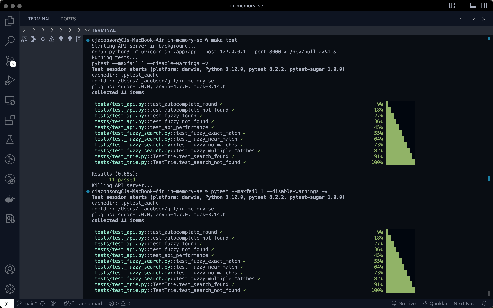

# Testing Guide

This document provides instructions on how to run the tests for the In-Memory Search Engine project and details the tests that pass when run locally.


<p align="center">
   
</p>


## Running Tests

### Prerequisites
- Ensure you have installed all dependencies:
  ```bash
  pip install -r requirements.txt
  ```

### Running Tests with Make
You can use the `Makefile` to run tests easily. The following commands are available:

- **Run all tests:**
  ```bash
  make test
  ```

### Running Tests with Pytest
Alternatively, you can run the tests directly using `pytest`:

- **Run all tests:**
  ```bash
  pytest --maxfail=1 --disable-warnings -v
  ```

## Test Coverage

### Unit Tests
Unit tests are located in the `tests/` directory and cover the core functionalities of the project.

#### Test Files
- **tests/test_fuzzy_search.py:** Tests for the fuzzy search functionality.
- **tests/test_api.py:** Integration tests for the FastAPI endpoints.
- **tests/test_trie.py:** Tests for the trie data structure.

### Example Test Output
Here is an example of the test output when running `pytest`:

```plaintext
============================= test session starts ==============================
platform darwin -- Python 3.10.0, pytest-7.0.0, pytest-sugar-0.9.4
rootdir: /Users/cjacobson/git/in-memory-se
plugins: sugar-0.9.4
collecting ... 
 tests/test_api.py::test_autocomplete_found ✓                                                                                                      10% ▉         
 tests/test_api.py::test_autocomplete_not_found ✓                                                                                                  20% ██        
 tests/test_api.py::test_fuzzy_found ✓                                                                                                            30% ███       
 tests/test_api.py::test_fuzzy_not_found ✓                                                                                                        40% ████      
 tests/test_api.py::test_api_performance ✓                                                                                                        50% █████     
 tests/test_fuzzy_search.py::test_fuzzy_exact_match ✓                                                                                             60% █████▉    
 tests/test_fuzzy_search.py::test_fuzzy_near_match ✓                                                                                              70% ███████   
 tests/test_fuzzy_search.py::test_fuzzy_no_matches ✓                                                                                              80% ████████  
 tests/test_fuzzy_search.py::test_fuzzy_multiple_matches ✓                                                                                        90% █████████ 
 tests/test_trie.py::test_search_found ✓                                                                                                          100% ██████████

Results (0.02s):
      10 passed
```

### Test Descriptions

#### tests/test_fuzzy_search.py
- **test_fuzzy_exact_match:** Verifies exact matches return perfect similarity scores.
- **test_fuzzy_near_match:** Verifies near matches are found with appropriate similarity scores.
- **test_fuzzy_no_matches:** Verifies no matches are returned when edit distance is too large.
- **test_fuzzy_multiple_matches:** Verifies multiple matches are returned in order of similarity.

#### tests/test_api.py
- **test_autocomplete_found:** Tests successful autocomplete search.
- **test_autocomplete_not_found:** Tests autocomplete with non-matching prefix.
- **test_fuzzy_found:** Tests successful fuzzy search.
- **test_fuzzy_not_found:** Tests fuzzy search with no matches.
- **test_api_performance:** Tests API endpoint performance.

#### tests/test_trie.py
- **test_search_found:** Tests successful search in the trie.
- **test_search_not_found:** Tests search with no matches in the trie.

## Conclusion
This guide provides a comprehensive overview of how to run tests for the In-Memory Search Engine project and details the tests that pass when run locally. By following these instructions, you can ensure that all functionalities are working correctly and maintain the quality of the project.
